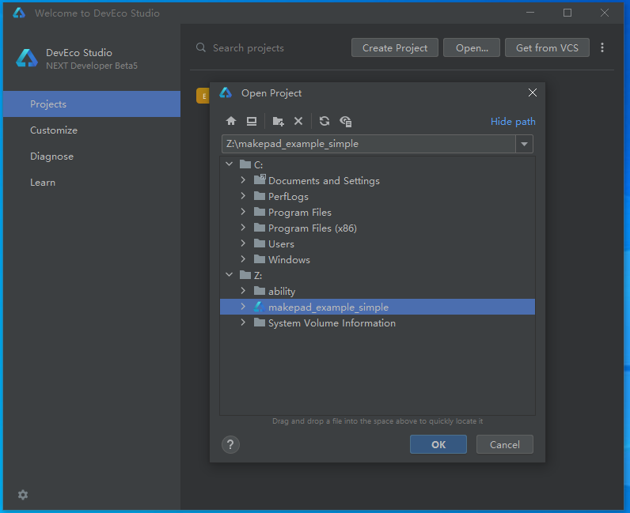
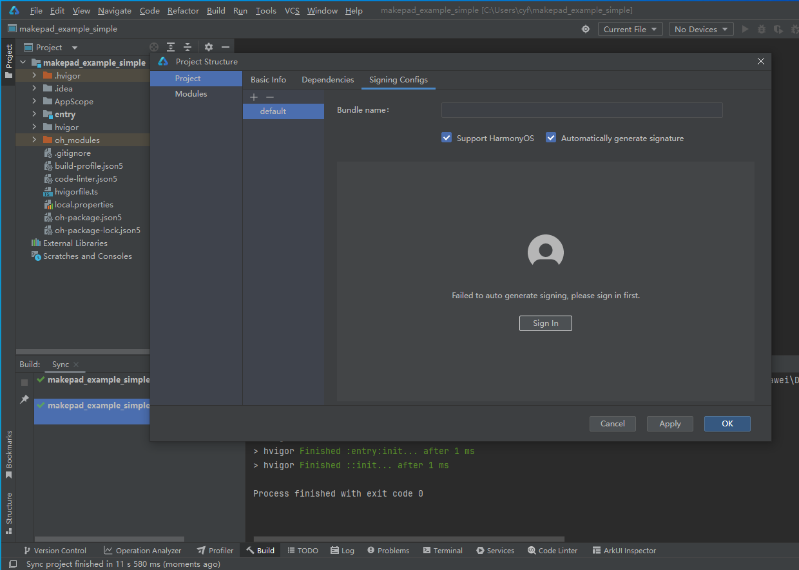

Makepad open harmony quick build example for Linux-x64, Windows and MacOS

Please plug an OpenHarmony device into your PC via USB.

## Install DevEco
Downlaod DevEco from this page: <https://developer.huawei.com/consumer/cn/download/>

For `Linux-x64`, there is no `DevEco Studio` for `Linux`, please use the `Command Line Tools`


For `Windows` and `MacOS`, please install `DevEco Studio`


Make sure you can compile and run 'Hello, world!' with the `DevEco Studio`


## Install toolchain

Run the following command to install needed tools for building the Open Harmony applications

```
cargo makepad ohos install-toolchain
```


## Create DevEco Project

Note: if you are building for an OpenHarmony simulator/emulator, make sure to set the `MAKEPAD=ohos_sim` environment variable
either permanently in your shell, or in front of each command below.


Run the following command to create a DevEco project for the `makepad-example-simple`

```
cargo makepad ohos --deveco-home=<path-to-deveco> deveco -p makepad-example-simple --release
```

`deveco-home` can also be specified by environment variable `DEVECO_HOME`
```
DEVECO_HOME=<$HOME/command-line-tools> cargo makepad ohos deveco -p makepad-example-simple --release
```

After this command, it would generates a DevEco Project in `target/makepad-open-harmony/makepad_example_simple`

## Signing With DevEco
Use `DevEco studio` to sign the project, for the Linux user, please copy the project to Windows/MacOS, then sign it with `DevEco studio`

Open the project with `DevEco`



Click `File` -> `Project Structure` -> `Signing Configs` -> `Sign in`



After signing in, make sure to click the "Apply" button on the bottom right of the `Signing Configs` pane.

Then, the DevEco IDE will auto-populate the `signingConfigs` array within the `build-profile.json5` file,
which should be located at the path:
`target/makepad-open-harmony/makepad_example_simple/build-profile.json5`

The contents of that file will look something like this (we have redacted the paths and password fields):
```json
{
  "app": {
    "signingConfigs": [
        {
            "name": "default",
            "type": "HarmonyOS",
            "material":{
                "certpath": "<path-to-cer-file>",
                "storePassword": "xxxxxxxxx",
                "KeyAlias": "debugKey",
                "KeyPassword": "yyyyyyyyyy",
                "profile": "<path-to-p7b-file>",
                "signAlg": "SHA256withECDSA",
                "storeFile": "<path-to-p12-file>"
            }
        }
    ],
    "products": [
      {
        "name": "default",
        "signingConfig": "default",
        "compatibleSdkVersion": "5.0.0(12)",
        "runtimeOS": "HarmonyOS",
      }
    ],
    "buildModeSet": [
      {
        "name": "debug",
      },
      {
        "name": "release"
      }
    ]
  },
  "modules": [
    {
      "name": "makepad",
      "srcPath": "./entry",
      "targets": [
        {
          "name": "default",
          "applyToProducts": [
            "default"
          ]
        }
      ]
    }
  ]
}
```

For the `Linux` user please copy the relevant files and edit `build-profile.json5` manually.

## Build/Run with Deveco
For the Windows/MacOs user, you can directly use `DevEco Studio`  to build and run

## Build/Run in Command line
Run the following command to build and `makepad-example-simple` in Open Harmony Device

```
cargo makepad ohos --deveco-home=<path-to-deveco> run -p makepad-example-simple --release
```

`deveco-home` can also be specified by environment variable `DEVECO_HOME`
```
DEVECO_HOME=<$HOME/command-line-tools> cargo makepad ohos run -p makepad-example-simple --release
```

After this command, it would generates a Hap file  in `target/makepad-open-harmony/makepad_example_simple/entry/build/outputs/default/makepad-default-signed.hap`


## HDC Remote

`PC A` could access `Open Harmony Device` with `hdc`, but the `makepad` project is in `PC B`, and it can access `PC A` with network

start `HDC Remote` in `PC A`
```
hdc -s <ip-of-A>:8710 -m
```

In `PC B`, it can access the `Open Harmony Device` with the following command
```
cargo makepad ohos --deveco-home=<path-to-deveco> --remote=<ip-of-A>:8710 run -p makepad-example-simple --release
```
`remote` can also be specified by environment variable `HDC_REMOTE`

```
DEVECO_HOME=<$HOME/command-line-tools> HDC_REMOTE=<ip-of-A>:8710 cargo makepad ohos run -p makepad-example-simple --release
```


## References
- <https://book.servo.org/hacking/building-for-openharmony.html#configuring-hdc-on-linux>
- <https://gitee.com/openharmony-sig/flutter_engine>